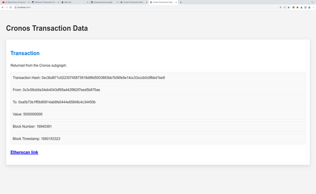

# About

This is an express app to display data about the Cronos token (viewable on Etherscan [here](https://etherscan.io/address/0xA0b73E1Ff0B80914AB6fe0444E65848C4C34450b)), using a subgraph dedicated to the Cronos token.

The relevant code is in server.js, public/data.html, public/info.html, graph_query.js, and info_query.js.

You can view the homepage to see a query (viewable in [graph_query.js](graph_query.js)) showing the contents of one transaction, which is displayed using HTML there and at /data.html ([screenshot](tx_page.png)).

You can also visit /info.html to see the info query (viewable in [info_query.js](info_query.js)), which is meant to show info about the project ([screenshot](info_page.png)).

All the queries, as given in [graph_query.js](graph_query.js), [alt_query.js](alt_query.js) and [info_query.js](info_query.js), can be tested out.

# How to Run

Note: you'll need an API key from the Graph. You'll also need to change the part of the code where I specify the API key in server.js. In my code, it is taken from an environment variable stored in GRAPH_API_KEY.

You can run the app locally by running these commands:

`cd (directory)`

`npm install`

`npm start`

Go to localhost:3000 in your browser and you should see the data displayed for a single transaction, fetched on the basis of its transaction hash.

You can view content at these routes: / (transaction query), /data.html (transaction query - same query) and /info.html (info query).

You can always go to [Etherscan](https://etherscan.io/address/0xA0b73E1Ff0B80914AB6fe0444E65848C4C34450b), to the Cronos token smart contract address, to find a different transaction, if you want to change the transactionHash part of the query in graph_query.js to see another transaction.
